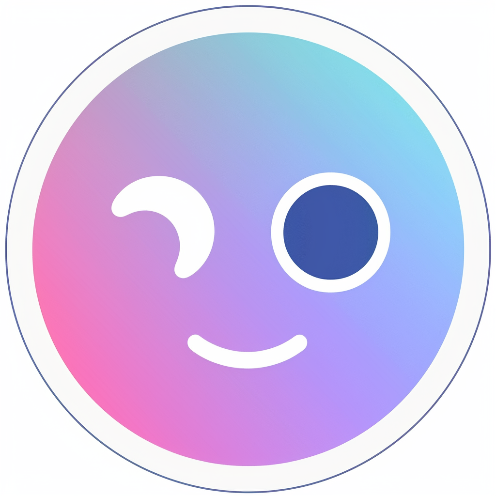

<!-- Template for readme used: https://github.com/othneildrew/Best-README-Template -->

<!-- PROJECT SHIELDS -->
<!--
*** I'm using markdown "reference style" links for readability.
*** Reference links are enclosed in brackets [ ] instead of parentheses ( ).
*** See the bottom of this document for the declaration of the reference variables
*** for contributors-url, forks-url, etc. This is an optional, concise syntax you may use.
*** https://www.markdownguide.org/basic-syntax/#reference-style-links
-->
[![Contributors][contributors-shield]][contributors-url]
[![Forks][forks-shield]][forks-url]
[![Stargazers][stars-shield]][stars-url]
[![Issues][issues-shield]][issues-url]
[![MIT License][license-shield]][license-url]

<!-- PROJECT LOGO -->
 

<h3 align="center">OpenGPT</h3>

  

  

    Open Source ChatGPT-4 discord bot
     
     
    <a href="https://github.com/CoasterFreakDE/OpenGPT/issues">Report Bug</a>
    ·
    <a href="https://github.com/CoasterFreakDE/OpenGPT/issues">Request Feature</a>
  

<!-- ABOUT THE PROJECT -->

## About The Project

Coming soon...

(<a href="#readme-top">back to top</a>)

### Built With

* [![Python][Python]][Python-url]
* [![discord4py][discord4py]][discord4py-url]

(<a href="#readme-top">back to top</a>)

<!-- GETTING STARTED -->

## Getting Started

To get a local copy up and running follow these simple steps.

### Prerequisites

You need the following software to run this plugin:

* Python 3.9+
* [OpenAI Account with billing method](https://platform.openai.com/account/usage)

### Installation

1. Clone the repository
2. Use `pip install -r requirements.txt` to install all dependencies
3. Rename `.env.example` to `.env` and edit your openai api and discord bot token
4. Start the bot with `python opengpt.py` 

(<a href="#readme-top">back to top</a>)

<!-- ROADMAP -->

## Roadmap

- [ ] Threads
- [ ] File Support
- [ ] Image Support (GPT-4 api added image support)

See the [open issues](https://github.com/CoasterFreakDE/OpenGPT/issues?q=is%3Aissue+is%3Aopen+sort%3Aupdated-desc) for a full
list of proposed features (and known issues).

(<a href="#readme-top">back to top</a>)

<!-- CONTRIBUTING -->

## Contributing

Contributions are what make the open source community such an amazing place to learn, inspire, and create. Any
contributions you make are **greatly appreciated**.

If you have a suggestion that would make this better, please fork the repo and create a pull request. You can also
simply open an issue with the tag "enhancement".
Don't forget to give the project a star! Thanks again!

1. Fork the Project
2. Create your Feature Branch (`git checkout -b feature/AmazingFeature`)
3. Commit your Changes (`git commit -m 'Add some AmazingFeature'`)
4. Push to the Branch (`git push origin feature/AmazingFeature`)
5. Open a Pull Request

### Branch naming

* `feature/` for new features
* `fix/` for bug fixes
* `docs/` for documentation changes
* `refactor/` for code changes that neither fixes a bug nor adds a feature
* `style/` for formatting, missing semi colons, etc; no code change
* `test/` for everything related to testing
* `chore/` for updating build tasks, package manager configs, etc; no production code change

(<a href="#readme-top">back to top</a>)

<!-- LICENSE -->

## License

Distributed under the MIT License. See `LICENSE` for more information.

(<a href="#readme-top">back to top</a>)

<!-- CONTACT -->

## Contact

Project Link: [https://github.com/CoasterFreakDE/OpenGPT](https://github.com/CoasterFreakDE/OpenGPT)

(<a href="#readme-top">back to top</a>)

<!-- ACKNOWLEDGMENTS -->

## Acknowledgments

* [GitHub Emoji Cheat Sheet](https://www.webpagefx.com/tools/emoji-cheat-sheet)
* [Img Shields](https://shields.io)

(<a href="#readme-top">back to top</a>)

<!-- MARKDOWN LINKS & IMAGES -->
<!-- https://www.markdownguide.org/basic-syntax/#reference-style-links -->

[contributors-shield]: https://img.shields.io/github/contributors/CoasterFreakDE/OpenGPT.svg?style=for-the-badge
[contributors-url]: https://github.com/orgs/CoasterFreakDE/OpenGPT/graphs/contributors
[forks-shield]: https://img.shields.io/github/forks/CoasterFreakDE/OpenGPT.svg?style=for-the-badge
[forks-url]: https://github.com/CoasterFreakDE/OpenGPT/network/members
[stars-shield]: https://img.shields.io/github/stars/CoasterFreakDE/OpenGPT.svg?style=for-the-badge
[stars-url]: https://github.com/CoasterFreakDE/OpenGPT/stargazers
[issues-shield]: https://img.shields.io/github/issues/CoasterFreakDE/OpenGPT.svg?style=for-the-badge
[issues-url]: https://github.com/CoasterFreakDE/OpenGPT/issues
[license-shield]: https://img.shields.io/github/license/CoasterFreakDE/OpenGPT.svg?style=for-the-badge
[license-url]: https://github.com/orgs/CoasterFreakDE/OpenGPT/main/LICENSE
[Python]: https://img.shields.io/badge/Language-Python-green
[Python-url]: https://www.python.org/
[discord4py]: https://img.shields.io/badge/Framework-discord4py-blue
[discord4py-url]: https://github.com/mccoderpy/discord.py-message-components
